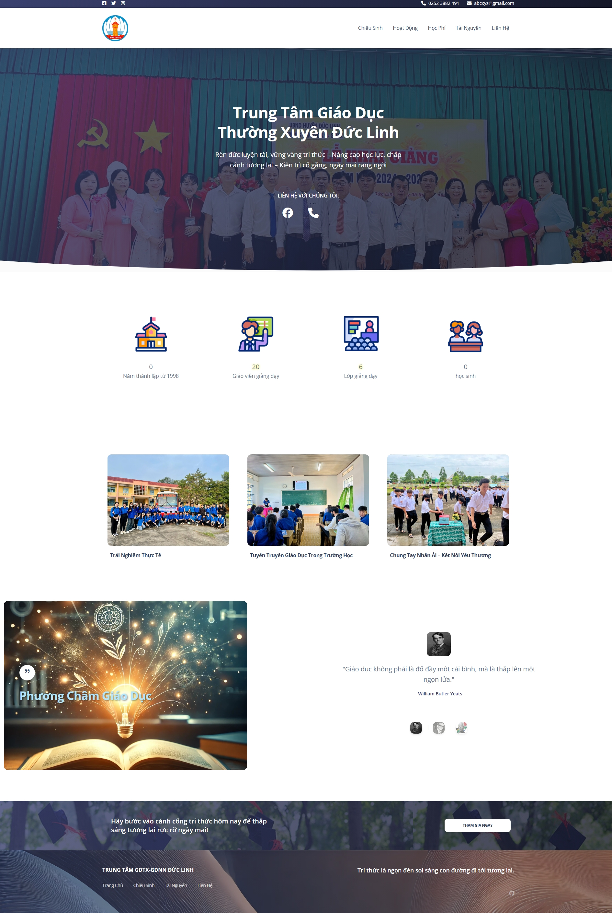

# TTGDTX-GDNN ĐỨC LINH

## Description
This project is a website for TTGDTX-GDNN Đức Linh, providing information about the center's activities, admissions, tuition, resources, and contact details.

## Features
- **Chiêu Sinh**: Information about admissions.
- **Hoạt Động**: Details about the center's activities.
- **Học Phí**: Information about tuition fees.
- **Tài Nguyên**: Resources available at the center.
- **Liên Hệ**: Contact information.

## Usage
Open `index.html` in your web browser to view the website.

## Screenshots



## Project Structure
```
.
├── about.html
├── hoatdong.html
├── index.html
├── README.md
├── tainguyen.html
├── tuyensinh.html
├── assets/
│   ├── css/
│   │   ├── boostrap.css
│   │   └── theme.css
│   ├── img/
│   │   ├── 1_2.png
│   │   ├── 3.webp
│   │   ├── 122_1.png
│   │   ├── 12146142.gif
│   │   ├── 16675757.gif
│   │   ├── 17428653.gif
│   │   ├── ...
│   ├── js/
│   │   ├── bootstrap.min.js
│   │   ├── countup.min.js
│   │   ├── flatpickr.min.js
│   │   └── soft-design-system.min.js
│   ├── fonts/
│   │   ├── VZAP.ttf
│   └── pdf/
│       ├── sgktoan1.pdf
│       ├── sgktoan2.pdf
│       └── vl.pdf
```

## Credits
- **Bootstrap**: [Bootstrap](https://getbootstrap.com/)
- **FontAwesome**: [FontAwesome](https://fontawesome.com/)
- **Soft UI Design System**: [Soft UI Design System](https://www.creative-tim.com/product/soft-ui-design-system)
